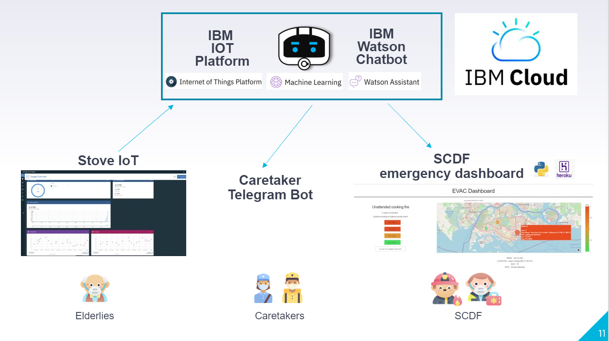
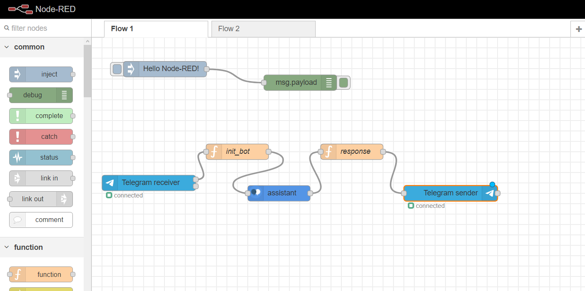

# ProjectEVAC

[TOC]


## Short Description

#### What's the problem?

Vulnerable populations (seniors and elderlies) are prone to unexpected and careless emergency situations such as unattended cooking fires, falls or cardiac arrest. This situation is worsen by the prolong separation of caretakers and family due to COVID-19, hence making it more dangerous for vulnerable populations.

#### How can technology help?

Having a technology stack that is fully automated and runs even during outbreaks provides reliability in emergency situations. As the future is uncertain, we can rely on technology to provide consistent and unbias data.

#### The idea

To tackle the situation at hand, our team propose Elderly Virtual Alerting Companion (EVAC), a virtual emergency caretaker that provides real time hazard detection through IoT sensors and AI emergency analyzation. Through cloud integration, onsite monitoring and intervention, EVAC is able to provide early intervention at all stages of emergency.


## Demo Video

url


## Solution Architecture


1. Stove IoT data (smoke sensor / flame sensor / object detector / flowrate sensor) will be pushed to IBM IOT Platform
2. Model trained by IBM machine learning will codify the status of the user
   - Red = danger
   - Orange = alert
   - green = safe
3. The status level will be sent to the caretaker via telegram bot with IBM Watson Assistant
4. The status level as well as the user's information will be updated to the SCDF emergency dashboard for monitoring and alert notifications


## Solution Prototype


## Project Roadmap

The entire architecture is made to scale, with IBM cloud as the core service provider. Going forward, the system can be scaled toward the IoT integration (monitoring and intervention) as well as the analytics provider (dashboard and alert notifications)

Under the IoT integration, potential add-on into the system includes:

- Convenient wearables that could detect fall/heart rate
- Personal household robotic scanner that could track activity coverage in the house.  

### Getting Started

These instructions will allow you to get the project up and running on your local machine for deployment and testing purposes. If you would like to view the project without running on your local machine, we provided the link to hosted project below.

#### Prerequisites

For the SCDF dashboard, you would require python 3.6.9 or above and install the following packages

```
pip3 install pandas
pip3 install dash
pip3 install  plotly
```

Clone the entire folder

```
git clone  https://github.com/waihongtan/ProjectEVAC.git
```

To start the server, cd into the /ProjectEVAC/scdf_dashboard and run

```
python3 app.py
```


## Live Demo

SCDF Dashboard for unattended fire case : https://scdf-dashboard.herokuapp.com/

Head over to the dashboard to get simulated live updates of seniors with the EVAC IoT system integrated. 

IoT Analytics Dashboard : 

## Integration of IBM Watson and Telegram Bot
The integration is being done with node-red flow through the IBM cloud platform


Interact with the chatbot at telegram : t.me/projevac_bot


## Solution Technologies

EVAC is built upon many services that is provided by IBM to tap on the network and AI capabilities, leveraging the data extracted. Here are the services that was utilized.

#### Build with
- IBM Node-Red
- IBM IoT Platform
- IBM Watson Chatbot
- IBM Watson Machine Learning

#### Frameworks

- MQTT
- Python Flask and Dash
- Heroku


## Contributing

- Tan Wai Hong
- Ian Lim 
- Ong Xiang Qian
